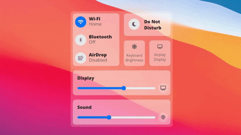

# Mac Os Big Sur Control Center in CSS

... With a little bit of Javascript.

I am a big fan of the redesigned Mac OS 11 that was only recently revealed (as of submitting this).
When I first saw the new Control Center I instantly thought it reminded me of a CSS Grid layout.
I thought about maybe replicating it.

Then I saw this tweet: https://twitter.com/jsngr/status/1277401395847745537
It recreated the Mac OS Big Sur Control Center in SwiftUI.
So... I had to push forward and make my CSS Grid based version.

Added some javascript to have it mock working.
It was just a bit of fun.
